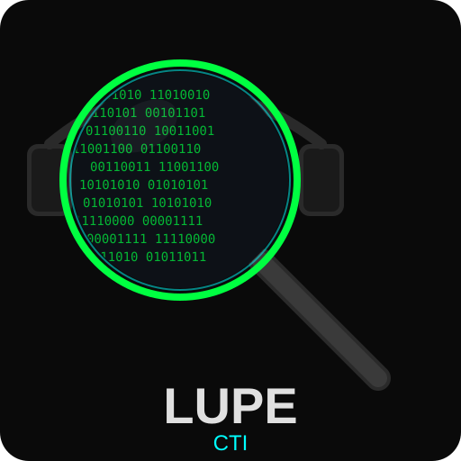

<p align="center">
  
</p>

<h1 align="center">Lupe CTI</h1>

<p align="center">
  <strong>Cyber Threat Intelligence for OSINT, Forensics & Incident Response</strong>
</p>

<p align="center">
  <a href="https://github.com/Alexso9410/lupe-cti/actions"></a>
  <a href="https://github.com/Alexso9410/lupe-cti/actions/workflows/codeql.yml"></a>
  <a href="https://pypi.org/project/lupe-cti/"></a>
  <a href="https://pypi.org/project/lupe-cti/"></a>
  <a href="https://www.python.org/downloads/"></a>
  <a href="https://github.com/astral-sh/ruff"></a>
  <a href="https://github.com/Alexso9410/lupe-cti/actions/workflows/ci.yml"></a>
  <a href="LICENSE"></a>
</p>

---

**Lupe CTI** is an open-source CLI tool for enriching Indicators of Compromise (IOCs) by querying multiple threat intelligence sources in parallel. Built for OSINT researchers, forensic analysts, incident responders, and blue team operators, it combines a powerful plugin-based enrichment engine with multi-provider LLM analysis and an interactive terminal UI.

Unlike monolithic threat intel platforms, Lupe CTI runs locally, respects your data privacy, and integrates seamlessly into forensic workflows and Linux distributions. It was designed from the ground up with a security-first mindset: HTTPS-only transport, secret redaction, input validation, and rate limiting are built into the core.

## Features

- **IOC Enrichment** — 25+ built-in plugins for IP, domain, URL, hash, email, phone, and username lookups
- **Multi-LLM Analysis** — AI-powered analysis via Ollama (local), OpenAI, Anthropic, or OpenRouter
- **Desktop App** — Native desktop GUI built with Flet (Material Design 3) for visual exploration
- **MISP Integration** — Pull/push indicators to/from MISP instances via raw REST API
- **Security-First** — HTTPS-only transport, IOC validation, secret redaction, token-bucket rate limiting
- **XDG-Compliant** — Data, config, and cache directories follow platform conventions (Linux, Windows, macOS)
- **Cross-Platform** — Native support for Linux, Windows, and macOS
- **Plugin Architecture** — Easy to extend with custom enrichment plugins
- **Export Formats** — Obsidian Markdown, JSON, and PDF report generation
- **Open Source** — MIT licensed, community-driven

## Installation

### pipx (recommended)

```bash
pipx install lupe-cti
```

### pip

```bash
pip install lupe-cti
```

### From source

```bash
git clone https://github.com/Alexso9410/lupe-cti.git
cd lupe
pip install -e ".[dev]"
```

### Debian / Ubuntu

Lupe CTI is designed for integration into forensic Linux distributions. Package repository inclusion is planned.

### Windows

```powershell
pipx install lupe-cti
# or
pip install lupe-cti
```

## Quick Start

```bash
# Show help
lupe --help

# Enrich an IP address
lupe enrich 8.8.8.8

# Enrich a domain
lupe enrich example.com

# Enrich a hash
lupe enrich 44d88612fea8a8f36de82e1278abb02f

# Launch the desktop app
lupe-desktop

# Pull indicators from MISP
lupe misp pull --tag osint --days 7

# Migrate data from legacy Centinela installation
lupe migrate-from-centinela
```

## Configuration

Lupe CTI uses environment variables with the `LUPE_` prefix. You can set them in a `.env` file in your working directory or export them in your shell.

### Environment Variables

| Variable | Description | Default |
|---|---|---|
| `LUPE_OLLAMA_BASE_URL` | Ollama server URL | `http://localhost:11434` |
| `LUPE_OLLAMA_MODEL` | Ollama model name | `gemma4:31b-cloud` |
| `LUPE_LLM_PROVIDER` | LLM provider (`ollama`, `openai`, `anthropic`, `openrouter`) | *(empty = skip AI)* |
| `LUPE_OPENAI_API_KEY` | OpenAI API key | — |
| `LUPE_ANTHROPIC_API_KEY` | Anthropic API key | — |
| `LUPE_OPENROUTER_API_KEY` | OpenRouter API key | — |
| `LUPE_MISP_URL` | MISP instance URL | — |
| `LUPE_MISP_KEY` | MISP API key | — |
| `LUPE_VIRUSTOTAL_KEY` | VirusTotal API key | — |
| `LUPE_ABUSEIPDB_KEY` | AbuseIPDB API key | — |
| `LUPE_SHODAN_KEY` | Shodan API key | — |
| `LUPE_OTX_KEY` | AlienVault OTX key | — |
| `LUPE_URLSCAN_KEY` | URLScan.io API key | — |
| `LUPE_HIBP_KEY` | Have I Been Pwned API key | — |
| `LUPE_GREYNOISE_KEY` | GreyNoise API key | — |
| `LUPE_IPQS_KEY` | IPQualityScore API key | — |
| `LUPE_NUMVERIFY_KEY` | NumVerify API key | — |
| `LUPE_SPAMHAUS_KEY` | Spamhaus API key | — |
| `LUPE_HYBRID_ANALYSIS_KEY` | Hybrid Analysis API key | — |
| `LUPE_CENSYS_ID` | Censys API ID | — |
| `LUPE_CENSYS_SECRET` | Censys API secret | — |
| `LUPE_DB_PATH` | Custom database path | XDG default |

### Settings File

Lupe CTI stores its configuration in `~/.config/lupe/lupe.toml` (XDG-compliant). On Windows: `%APPDATA%\Lupe\lupe.toml`. The desktop app settings panel provides a visual editor for all API keys.

### Getting API Keys

| Provider | Free Tier | Sign Up |
|---|---|---|
| VirusTotal | Yes (limited) | [virustotal.com](https://www.virustotal.com/gui/join-us) |
| AbuseIPDB | Yes | [abuseipdb.com](https://www.abuseipdb.com/register) |
| Shodan | Yes (limited) | [shodan.io](https://account.shodan.io/register) |
| OTX | Yes | [otx.alienvault.com](https://otx.alienvault.com/) |
| URLScan | Yes | [urlscan.io](https://urlscan.io/user/signup/) |
| HIBP | Paid | [haveibeenpwned.com](https://haveibeenpwned.com/API/Key) |
| GreyNoise | Yes (community) | [greynoise.io](https://viz.greynoise.io/signup) |
| IPQualityScore | Yes | [ipqualityscore.com](https://www.ipqualityscore.com/create-account) |
| Spamhaus | Yes | [spamhaus.com](https://spamhaus.com/) |
| Hybrid Analysis | Yes | [hybrid-analysis.com](https://www.hybrid-analysis.com/signup) |
| Censys | Yes | [censys.io](https://censys.io/register) |
| OpenAI | Paid | [platform.openai.com](https://platform.openai.com/signup) |
| Anthropic | Paid | [console.anthropic.com](https://console.anthropic.com/) |
| OpenRouter | Yes (limited) | [openrouter.ai](https://openrouter.ai/) |

## Plugins

### Built-in (Free, No Key Required)

| Plugin | IOC Types | Description |
|---|---|---|
| Whois | IP, Domain | WHOIS registration data |
| IPInfo | IP | Geolocation and ASN data |
| ThreatFox | IP, Domain, URL | IOC sharing by abuse.ch |
| URLhaus | URL, Domain | Malicious URL feed by abuse.ch |
| MalwareBazaar | Hash | Malware sample database by abuse.ch |
| PhoneStatic | Phone | Phone number formatting and carrier |
| WhatsMyName | Username | Username enumeration across platforms |
| IPQuery | IP | IP geolocation and threat data |
| CertSh | Domain | Certificate transparency logs |
| CIRCL Hashlookup | Hash | Known file hash lookup |
| Holehe | Email | Account discovery by email |
| Blocklist.de | IP | Blocklist aggregation |
| crt.sh | Domain | Certificate transparency (Sectigo) |

### Keyed (API Key Required)

| Plugin | IOC Types | Env Var |
|---|---|---|
| VirusTotal | IP, Domain, URL, Hash | `LUPE_VIRUSTOTAL_KEY` |
| AbuseIPDB | IP | `LUPE_ABUSEIPDB_KEY` |
| Shodan | IP | `LUPE_SHODAN_KEY` |
| OTX | IP, Domain, Hash | `LUPE_OTX_KEY` |
| URLScan | URL, Domain | `LUPE_URLSCAN_KEY` |
| Have I Been Pwned | Email | `LUPE_HIBP_KEY` |
| GreyNoise | IP | `LUPE_GREYNOISE_KEY` |
| IPQualityScore | IP, Domain, Phone | `LUPE_IPQS_KEY` |
| NumVerify | Phone | `LUPE_NUMVERIFY_KEY` |
| EmailRep | Email | `LUPE_EMAILREP_KEY` |
| Google Safe Browsing | URL, Domain | `LUPE_GOOGLESB_KEY` |
| PhishTank | URL | `LUPE_PHISHTANK_KEY` |
| Pulsedive | IP, Domain, URL | `LUPE_PULSEDIVE_KEY` |
| Spamhaus | IP, Domain | `LUPE_SPAMHAUS_KEY` |
| Hybrid Analysis | Hash, URL | `LUPE_HYBRID_ANALYSIS_KEY` |
| Censys | IP, Domain, Hash | `LUPE_CENSYS_ID` + `LUPE_CENSYS_SECRET` |

### Adding a Custom Plugin

Create a new file in `lupe/enrichment/`:

```python
# lupe/enrichment/my_plugin.py
from __future__ import annotations

import httpx

from lupe.enrichment.base import EnrichmentPlugin, EnrichmentResult
from lupe.models import IOC, IOCType


class MyPlugin(EnrichmentPlugin):
    name = "my_plugin"
    supported_ioc_types = {IOCType.ipv4, IOCType.domain}
    requires_api_key = False

    async def enrich(self, ioc: IOC, client: httpx.AsyncClient) -> EnrichmentResult | None:
        resp = await client.get(f"https://api.example.com/{ioc.value}")
        if resp.status_code != 200:
            return None
        data = resp.json()
        return EnrichmentResult(
            source=self.name,
            raw=data,
            summary=f"Found {len(data.get('results', []))} results",
        )
```

Then register it in `lupe/enrichment/__init__.py` by adding it to the `_build_plugins()` function.

## Multi-LLM

Lupe CTI supports multiple LLM providers for AI-powered threat analysis. Set `LUPE_LLM_PROVIDER` to select one.

| Provider | Best For | Cost | Setup |
|---|---|---|---|
| `ollama` | Local analysis, air-gapped environments | Free | Install Ollama, pull a model |
| `openai` | High-quality analysis | Paid | Set `LUPE_OPENAI_API_KEY` |
| `anthropic` | Detailed reasoning | Paid | Set `LUPE_ANTHROPIC_API_KEY` |
| `openrouter` | Access to many models | Freemium | Set `LUPE_OPENROUTER_API_KEY` |

```bash
# Example: Use OpenAI for analysis
export LUPE_LLM_PROVIDER=openai
export LUPE_OPENAI_API_KEY=sk-...
lupe enrich 8.8.8.8

# Example: Use local Ollama (default)
export LUPE_LLM_PROVIDER=ollama
lupe enrich 8.8.8.8
```

## MISP Integration

Lupe CTI can pull and push indicators to/from [MISP](https://www.misp-project.org/) instances.

```bash
# Configure MISP
export LUPE_MISP_URL=https://misp.example.com
export LUPE_MISP_KEY=your-misp-api-key

# Pull indicators from the last 7 days
lupe misp pull --days 7

# Pull with tag filter
lupe misp pull --tag osint --days 30

# Push an IOC to MISP
lupe misp push 8.8.8.8 --tags suspicious,investigation
```

## Security

### Threat Model

Lupe CTI processes untrusted network data (IOC values, API responses) and handles sensitive credentials (API keys). The security model addresses:

- **Credential exposure**: All API keys are redacted in logs and CLI output
- **Transport security**: HTTPS-only for all external requests (except localhost Ollama)
- **Input validation**: IOC values are length-checked and type-validated before processing
- **Rate limiting**: Token-bucket rate limiter prevents API abuse
- **Config security**: Config directory has restricted permissions (chmod 700 on Linux)

### Hardening Applied

- Secret redaction in log output (`lupe/security/redact.py`)
- IOC input validation with per-type max lengths (`lupe/security/validation.py`)
- HTTPS-only transport enforcement (`lupe/security/https_only.py`)
- Token-bucket rate limiter for plugin concurrency (`lupe/security/rate_limit.py`)
- Pre-commit hooks: gitleaks (secrets), ruff (lint/format), bandit (security)
- CI pipeline: bandit, pip-audit, mypy, CodeQL analysis

### Reporting Vulnerabilities

Please report security vulnerabilities via [GitHub Security Advisories](https://github.com/Alexso9410/lupe-cti/security/advisories/new). Do **not** open a public issue for security reports.

We aim to acknowledge reports within 48 hours and provide a fix timeline within 7 days.

## Architecture

Lupe CTI follows a layered architecture:

```
lupe/
  cli.py              # Typer CLI entry point
  config.py           # Settings singleton (pydantic-settings + platformdirs)
  ioc_detect.py       # IOC type detection (regex-based)
  models.py           # Core data models (IOC, EnrichmentResult)
  analysis.py         # Multi-LLM analysis orchestrator
  db.py               # SQLite persistence layer
  migrate.py          # Legacy Centinela migration
  enrichment/         # Plugin system (25+ plugins)
    base.py           # EnrichmentPlugin ABC
    __init__.py       # Plugin registry + parallel runner
    *.py              # Individual plugins
  llm/                # Multi-LLM provider system
    base.py           # LLMProvider ABC
    registry.py       # Provider factory
    ollama.py         # Ollama provider
    openai.py         # OpenAI provider
    anthropic.py      # Anthropic provider
    openrouter.py     # OpenRouter provider
  security/           # Security hardening
    redact.py         # Secret redaction
    validation.py     # IOC input validation
    https_only.py     # HTTPS transport enforcement
    rate_limit.py     # Token-bucket rate limiter
  integrations/       # External integrations
    misp.py           # MISP REST client
  export/             # Export formats
    obsidian.py       # Obsidian Markdown
    json_export.py    # JSON
    pdf_report.py     # PDF (ReportLab)
  flet/               # Desktop app (Flet)
    app.py            # Main Flet application
    theme.py          # Color palette
    views/            # App views (Home, Enrich, Settings, MISP, Plugins, Cases)
```

For detailed design documentation, see [openspec/changes/lupe-cti-v1/design.md](openspec/changes/lupe-cti-v1/design.md).

## Development

```bash
# Clone and install dev dependencies
git clone https://github.com/Alexso9410/lupe-cti.git
cd lupe
pip install -e ".[dev]"

# Run tests
pytest

# Run tests with coverage
pytest --cov=lupe --cov-report=term-missing

# Lint
ruff check lupe/ tests/

# Format
ruff format lupe/ tests/

# Type check
mypy lupe/

# Security scan
bandit -r lupe/
pip-audit

# All checks at once
make all
```

### Adding a Plugin

See the [Contributing Guide](CONTRIBUTING.md) for a step-by-step tutorial on writing enrichment plugins.

### Coding Standards

- **TDD**: Tests first, implementation second
- **Conventional Commits**: All commit messages follow the [Conventional Commits](https://www.conventionalcommits.org/) specification
- **Ruff**: Code formatting and linting via [Ruff](https://github.com/astral-sh/ruff)
- **Type hints**: All public functions must have type annotations
- **Async**: All enrichment plugins use `async/await` with `httpx.AsyncClient`

## Systemd Integration

Lupe CTI ships with a systemd service unit for running automated enrichment on Linux systems.

```bash
# Install the service file
sudo cp assets/systemd/lupe-watch.service /etc/systemd/system/

# Create the lupe user (optional, for dedicated service user)
sudo useradd -r -s /usr/sbin/nologin lupe

# Create working directory
sudo mkdir -p /var/lib/lupe
sudo chown lupe:lupe /var/lib/lupe

# Reload and enable
sudo systemctl daemon-reload
sudo systemctl enable --now lupe-watch
```

The service unit is a template — adjust `ExecStart` in `assets/systemd/lupe-watch.service` to match your enrichment workflow. See the [service file](assets/systemd/lupe-watch.service) for security hardening options.

## Contributing

Contributions are welcome! Please see [CONTRIBUTING.md](CONTRIBUTING.md) for guidelines.

## Roadmap

- [ ] Multi-MISP consumer support
- [ ] Additional enrichment plugins (GreyNoise Community, Shodan InternetDB)
- [ ] Web dashboard
- [ ] STIX/TAXII export
- [ ] Automated threat scoring
- [ ] Plugin marketplace
- [ ] Docker image for containerized deployment

## License

Lupe CTI is released under the [MIT License](LICENSE).

## Acknowledgments

Lupe CTI stands on the shoulders of the open-source threat intelligence community:

- [abuse.ch](https://abuse.ch/) — ThreatFox, URLhaus, MalwareBazaar
- [MISP Project](https://www.misp-project.org/) — Threat intelligence sharing platform
- [Flet](https://flet.dev/) — Desktop app framework (Material Design 3)
- [Typer](https://typer.tiangolo.com/) — CLI framework
- [httpx](https://www.python-httpx.org/) — Async HTTP client
- [platformdirs](https://github.com/platformdirs/platformdirs) — Cross-platform directory resolution
- The forensic Linux distribution community for inspiring security-first tooling
